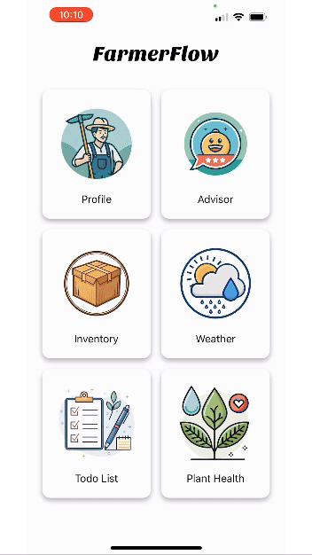
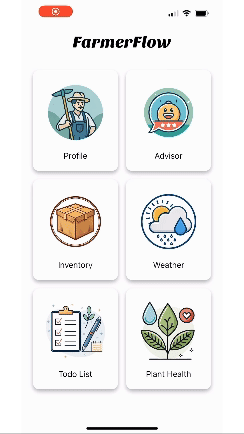
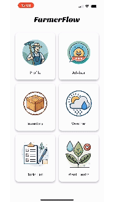
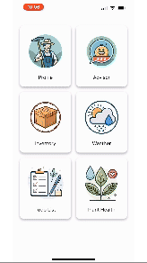

# 🌾 FarmerFlow

**Empowering Farmers with AI-driven Insights**

FarmerFlow is an innovative mobile application designed to help farmers manage and optimize their agricultural activities using artificial intelligence. With real-time insights and smart recommendations, FarmerFlow enhances efficiency and productivity in farming operations.

## 🚀 Features

✅ **AI-Powered Insights** – Get real-time recommendations based on weather, soil conditions, and crop data.  
✅ **Task Management** – Organize and track farming tasks efficiently.  
✅ **Inventory Management** – Monitor stock levels for seeds, fertilizers, and equipment.  
✅ **Weather Forecasting** – Stay ahead with precise weather predictions.  
✅ **Data Analytics** – Visualize farm performance with insightful dashboards.  

## 🛠 Tech Stack

- **Expo** – Fast and easy React Native development.  
- **React Native (TypeScript)** – For a robust and scalable mobile experience.  
- **Firebase** – Secure authentication, real-time database, and cloud functions.  

## 📲 Installation

1. Clone the repository:
   ```sh
   git clone https://github.com/mehdiougadi/PolyHacks2025-GitPushForce.git
   ```
2. Navigate to the project folder:
   ```sh
   cd client
   ```
3. Install dependencies:
   ```sh
   npm install
   ```
4. Start the Expo development server:
   ```sh
   npx expo start -c
   ```
5. Scan the QR code with the Expo Go app to test on your device.

## 🔥 Contributing

We welcome contributions! Please fork the repository, create a new branch, and submit a pull request.

## 📩 Contact

For inquiries, suggestions, or collaboration, feel free to reach out to us at Mehdiougadiofficial@gmail.com.

---

🌱 *FarmerFlow – Revolutionizing Agriculture with AI*

## Preview

Check out the app in action:






